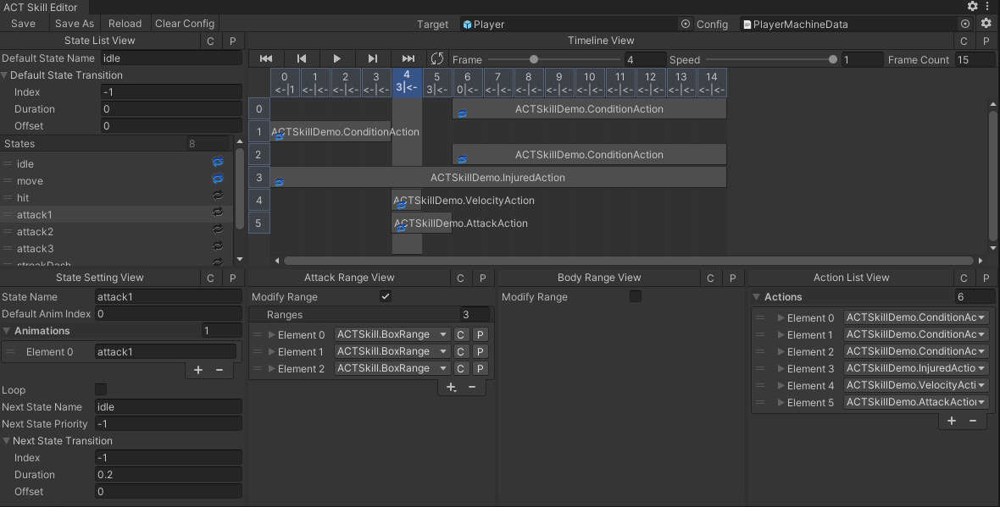

# ACTSkill
ACTSkill editor.

## Feature
- Visual editing attack/body range.
- Timeline to set action.

## Editor Window

## Usage
- Click "ACTSkill/Skill Editor" menu item to open editor window.
- Add state, edit state values, and edit frame count.
- Select frame to edit attack/body range.
- Add action.
    - Inherit `IAction` or `EditableFramesAction` to define action config class.
      Must add `[Serializable]` attribute to config class.
    - Inherit `IActionHandler` to handle action logic.
- Implement `IMachineController` to drive machine. 
  Some life cycle events can listen from `MachineBehaviour` and `StateHandler`.

## Animation
You can inherit `AnimationProcessor` to handle animation during editing.
Default use Animator to play animation.

## Version Support
Unity 2019_3_OR_NEWER

## Dependencies
- "com.mr-sb.customizationinspector": "https://github.com/Mr-sB/CustomizationInspector.git",
- "com.unity.editorcoroutines": "1.0.0"

## Demo
https://github.com/Mr-sB/ACTSkillDemo